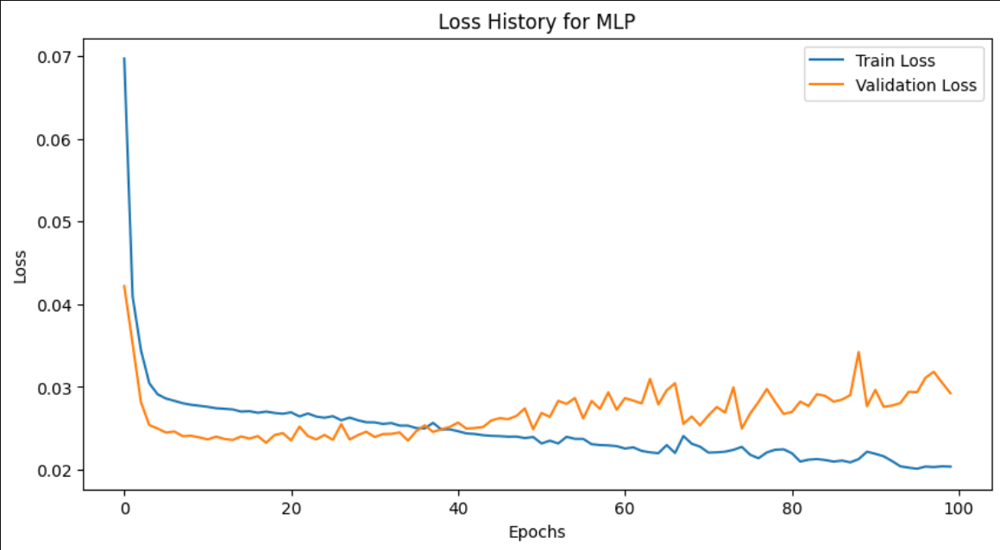
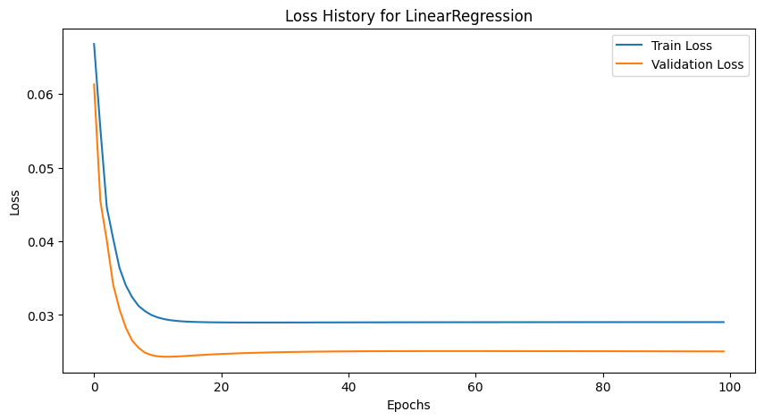
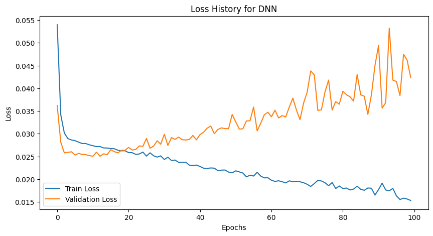

# CS672 – Introduction to Deep Learning
## Fall 2023 - Project #2: Diabetes Prediction Using PyTorch

This repository contains the materials for Project #2 of the CS672 course - Intro to Deep Learning, taught by Prof. Sarbanes in the Fall of 2023. The project focuses on predicting diabetes progression using various machine learning models implemented in PyTorch.

### Project Overview

The aim is to explore machine learning techniques and deep learning models to predict diabetes progression using a dataset from `scikit-learn`. The project involves data preparation, exploratory data analysis, model training and validation, and results interpretation.

### Dataset

The dataset comprises data from 442 diabetes patients, including features used to predict disease progression. It is accessed from the `scikit-learn` library.

### Methodology

- **Exploratory Data Analysis (EDA):** Data preparation, visualization, and statistical analysis to understand the dataset.
- **Model Development:** Implementation of MLP, Linear Regression, and Deep Neural Networks using PyTorch.
- **Training and Validation:** The dataset is split into training (80%) and validation (20%) sets for model evaluation.

### Results and Validation

- **Model Evaluation Metrics:**
    - The models used include **MLP**, **Linear Regression**, and **DNN**. Each model's training process involved Adam optimizer and Mean Squared Error loss function.
    - Validation loss was recorded for each model to evaluate performance.
    - Training vs validation loss plots were created to visualize the learning process and detect overfitting.

- **Best Performing Model:**
    - The **best model** was determined based on the lowest average validation loss. According to the notebook, the **<Linear Regression>** model performed the best with an average validation loss of **<value>**.

### Performance Metrics

- **Training and Validation Loss:** Detailed plots and summaries of the loss metrics over epochs are provided to understand model performance. The loss history for each model shows how the training and validation loss decreased over time.
- **Model Selection:** The best performing model is **<Linear Regression>** based on the lowest average validation loss.

- **Graphs:**
- 

### Conclusions

The project successfully implemented and compared different machine learning models to predict diabetes progression. The **<Linear Regression>** model showed the best performance based on the validation loss, highlighting the effectiveness of the chosen architecture and hyperparameters. Future work could explore further optimization, additional feature engineering, or different models to improve prediction accuracy.

### Usage

Instructions on how to run and interact with the project for replication or further development:

1. Clone this repository to your local machine.
2. Ensure all dependencies are installed, including PyTorch and `scikit-learn`.
3. Run the Jupyter notebook to view the models, training processes, and results.
